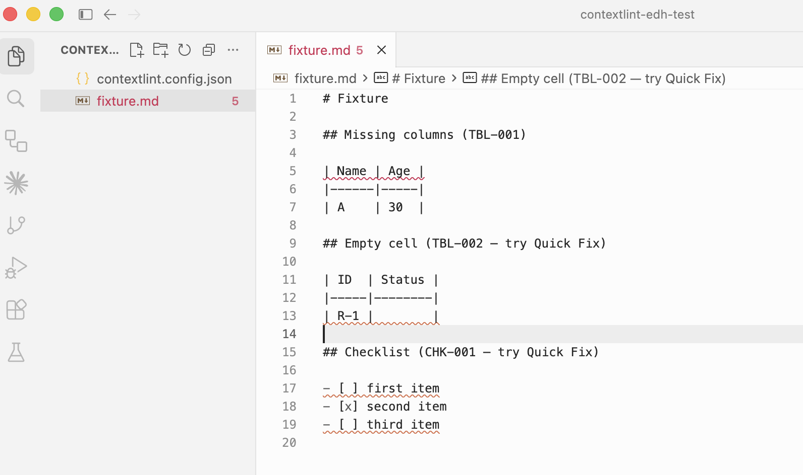
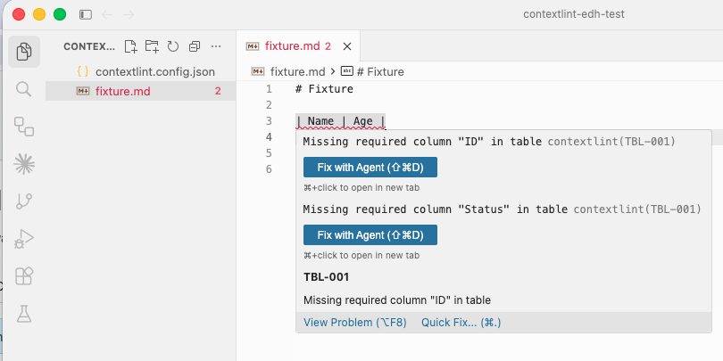
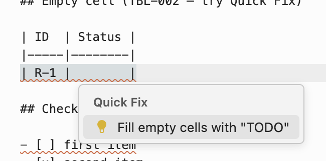
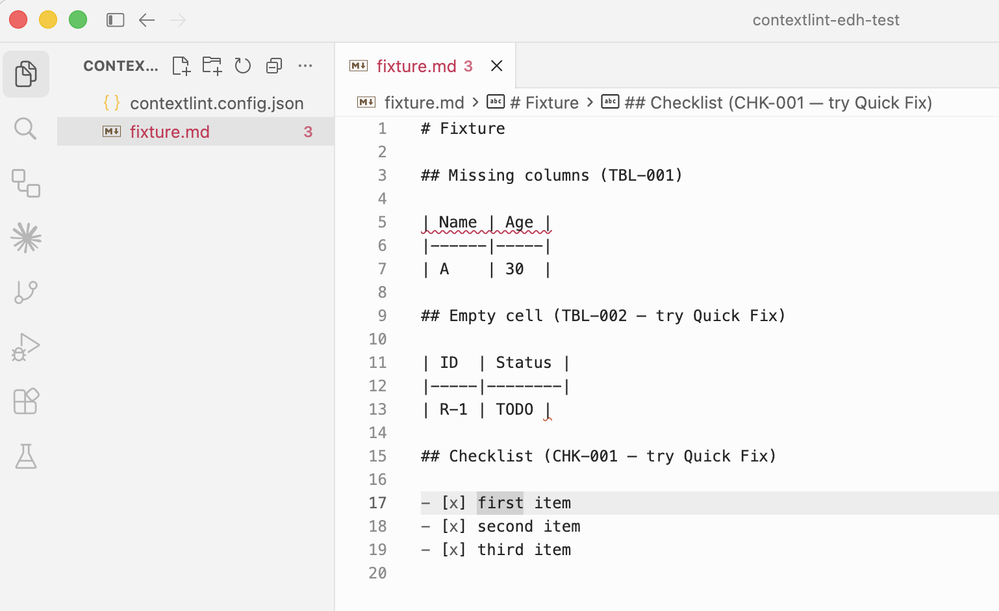

:::note
動作確認は VS Code / Cursor のみ。Neovim / Helix / JetBrains / VSCodium も LSP 仕様に沿った generic な設定で動くはずだが、現時点では未検証。
:::

contextlint には Language Server Protocol（LSP）実装である `@contextlint/lsp-server` が同梱されています。LSP 対応のエディタに組み込むと、Markdown ファイルを開いている間、編集中の差分を即時に lint し、診断・ホバー情報・Quick Fix をエディタ内で受け取れます。

## できること

- **診断（Diagnostics）** — 21 ルールすべての違反をエディタの該当行にインラインで表示
- **ホバー** — 違反箇所にカーソルを合わせると、ルール ID とメッセージを表示
- **Quick Fix** — 一部のルールについて、ワンクリックで自動修正
  - `CHK-001`: チェックリスト項目をチェック済みにする
  - `TBL-002`: 空セルに `TODO` を挿入する
- **クロスファイルルールの即時反映** — `REF-001` / `REF-002` / `TBL-006` / `GRP-*` などのファイル横断ルールも、ワークスペース全体のキャッシュを使って編集中に評価される

設定ファイルは CLI / MCP と同じ `contextlint.config.json` を使います。エディタ向けに別の設定ファイルを用意する必要はありません。

## 実際の画面

違反が検出されると、該当行にインラインで diagnostic が表示されます:



Hover すると、ルール ID と message の全文を確認できます:



Quick Fix が用意されているルールでは Lightbulb から自動修正できます。以下は `TBL-002`（空セル）に `TODO` を挿入する例です:



Quick Fix を適用すると、その場で diagnostic が消えます:



## インストール

```bash
# bun
bun add -D @contextlint/lsp-server

# npm
npm install -D @contextlint/lsp-server
```

LSP サーバーは `contextlint-lsp` というバイナリを提供します。多くのエディタはこのバイナリを `npx contextlint-lsp` で起動する形を取ります。

## VS Code

VS Code 用の拡張機能 `contextlint-vscode` を VSIX として配布しています。Marketplace 公開は今後の予定です。

GitHub Release から `contextlint-vscode-*.vsix` をダウンロードしてください。

```bash
code --install-extension contextlint-vscode-VERSION.vsix
```

または Extensions ビューから手動でインストールできます。

1. Extensions ビューを開く
2. **Views and More Actions...** から **Install from VSIX...** を選択
3. ダウンロードした `.vsix` ファイルを指定

インストール後は Markdown ファイルを開くと自動で LSP が起動し、最寄りの `contextlint.config.json` を使って診断が表示されます。追加設定は不要です。

## Cursor

Cursor は VS Code 互換のため、`contextlint-vscode` の VSIX をそのままインストールできます。手順は VS Code と同じです。

```bash
cursor --install-extension contextlint-vscode-VERSION.vsix
```

## Generic な LSP セットアップ

LSP 対応エディタに対しては、次の情報があれば組み込めます。

| 項目 | 値 |
| --- | --- |
| 起動コマンド | `npx contextlint-lsp` |
| プロトコル | LSP（stdio） |
| 対象ファイルタイプ | `markdown` |
| ルートディレクトリの判定 | `contextlint.config.json` の存在、なければ `.git` |
| 設定ファイル | ワークスペース直下またはその親階層の `contextlint.config.json` を自動検出 |

`contextlint-lsp` は `process.stdin` / `process.stdout` で LSP を話します。シングルファイル（プロジェクト外の単独ファイル）は対象外で、`contextlint.config.json` を見つけられたワークスペースに対してのみ動作します。

### Neovim（[nvim-lspconfig](https://github.com/neovim/nvim-lspconfig)）

```lua
local configs = require('lspconfig.configs')
local util = require('lspconfig.util')

if not configs.contextlint then
  configs.contextlint = {
    default_config = {
      cmd = { 'npx', 'contextlint-lsp' },
      filetypes = { 'markdown' },
      root_dir = util.root_pattern('contextlint.config.json', '.git'),
      single_file_support = false,
    },
  }
end

require('lspconfig').contextlint.setup({})
```

### Helix（`~/.config/helix/languages.toml`）

```toml
[language-server.contextlint]
command = "npx"
args = ["contextlint-lsp"]

[[language]]
name = "markdown"
language-servers = ["contextlint"]
```

### JetBrains IDE（[LSP4IJ](https://plugins.jetbrains.com/plugin/23257-lsp4ij)）

1. Marketplace から **LSP4IJ** プラグインをインストール
2. **Settings → Languages & Frameworks → Language Servers → Add** で次のように設定:
   - **Name**: `contextlint`
   - **Command**: `npx contextlint-lsp`
   - **Mapping → File name patterns**: `*.md`

## 既知の制約

- **外部からのファイル変更は監視されません。** `git pull` やエディタ外部のスクリプトでファイルが変更された場合、LSP のワークスペースキャッシュは自動更新されません。エディタウィンドウをリロード（VS Code / Cursor なら `Cmd+R` / `Ctrl+R`）するとキャッシュが再構築されます。
- **Quick Fix の対応ルールは現時点で 2 つ（`CHK-001` / `TBL-002`）のみ。** その他のルールについては、診断とホバーのみが提供されます。
